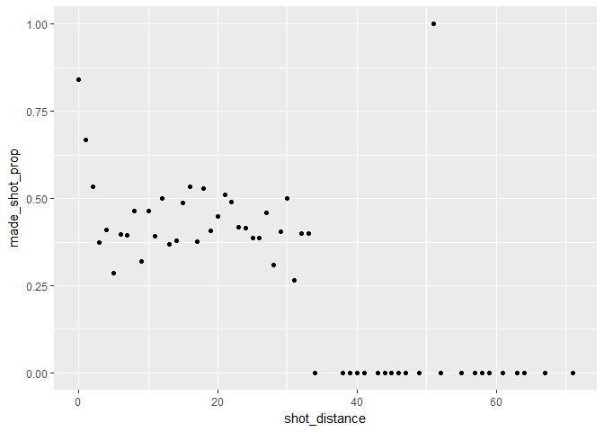

HW 02 - Shot Chart
================
Ren-Yi Wang
March 6, 2018

``` r
knitr::opts_chunk$set(echo = TRUE, fig.path = '../images/.')
source('../code/make-shots-data-script.R')
```

    ## 
    ## Attaching package: 'dplyr'

    ## The following objects are masked from 'package:stats':
    ## 
    ##     filter, lag

    ## The following objects are masked from 'package:base':
    ## 
    ##     intersect, setdiff, setequal, union

5) Summary Tables
-----------------

``` r
library(dplyr)

# 5.1) Total Shots by Player
total <- gsw %>%
  group_by(name) %>%
  summarise(total = n()) %>%
  arrange(desc(total))

total
```

    ## # A tibble: 5 x 2
    ##   name           total
    ##   <chr>          <int>
    ## 1 Stephen Curry   1250
    ## 2 Klay Thompson   1220
    ## 3 Kevin Durant     915
    ## 4 Graymond Green   578
    ## 5 Andre Iguodala   371

``` r
# 5.2) Effective Shooting Percentage
# Effective Shooting % by Player
effective_shooting <- gsw %>%
  select(name, shot_made_flag) %>%
  group_by(name) %>%
  summarise(total = n(), made = sum(shot_made_flag == 'made shot')) %>%
  mutate(perc_made = made/total) %>%
  arrange(desc(perc_made))

effective_shooting
```

    ## # A tibble: 5 x 4
    ##   name           total  made perc_made
    ##   <chr>          <int> <int>     <dbl>
    ## 1 Kevin Durant     915   495     0.541
    ## 2 Andre Iguodala   371   192     0.518
    ## 3 Klay Thompson   1220   575     0.471
    ## 4 Stephen Curry   1250   584     0.467
    ## 5 Graymond Green   578   245     0.424

``` r
# 2PT Effective Shooting % by Player
two_pt_effective_shooting <- gsw %>% 
  filter(shot_type == '2PT Field Goal') %>%
  group_by(name) %>%
  summarise(total = n(), made = sum(shot_made_flag == 'made shot')) %>%
  mutate(perc_made = made / total) %>%
  arrange(desc(perc_made))

two_pt_effective_shooting
```

    ## # A tibble: 5 x 4
    ##   name           total  made perc_made
    ##   <chr>          <int> <int>     <dbl>
    ## 1 Andre Iguodala   210   134     0.638
    ## 2 Kevin Durant     643   390     0.607
    ## 3 Stephen Curry    563   304     0.540
    ## 4 Klay Thompson    640   329     0.514
    ## 5 Graymond Green   346   171     0.494

``` r
# 3PT Effective Shooting % by Player
three_pt_effective_shooting <- gsw %>% 
  filter(shot_type == '3PT Field Goal') %>%
  group_by(name) %>%
  summarise(total = n(), made = sum(shot_made_flag == 'made shot')) %>%
  mutate(perc_made = made / total) %>%
  arrange(desc(perc_made))

three_pt_effective_shooting
```

    ## # A tibble: 5 x 4
    ##   name           total  made perc_made
    ##   <chr>          <int> <int>     <dbl>
    ## 1 Klay Thompson    580   246     0.424
    ## 2 Stephen Curry    687   280     0.408
    ## 3 Kevin Durant     272   105     0.386
    ## 4 Andre Iguodala   161    58     0.360
    ## 5 Graymond Green   232    74     0.319

6) Shooting Distance
--------------------

``` r
# 6.1) dplyr table
prop_shot <- gsw %>%
  group_by(shot_distance) %>%
  summarise(total = n(), made = sum(shot_made_flag == 'made shot')) %>%
  mutate(made_shot_prop = made/total) %>%
  select(shot_distance, made_shot_prop) %>%
  arrange(shot_distance)

prop_shot
```

    ## # A tibble: 56 x 2
    ##    shot_distance made_shot_prop
    ##            <int>          <dbl>
    ##  1             0          0.841
    ##  2             1          0.668
    ##  3             2          0.534
    ##  4             3          0.373
    ##  5             4          0.411
    ##  6             5          0.286
    ##  7             6          0.396
    ##  8             7          0.395
    ##  9             8          0.463
    ## 10             9          0.321
    ## # ... with 46 more rows

``` r
# 6.2) ggplot
# scatterplot with the variables shot_distance and made_shot_prop
library(ggplot2)

ggplot(data = prop_shot, aes(x = shot_distance, y = made_shot_prop)) +
  geom_point()
```



Observation: Players tend to have high accuracy when the shot distance is short. From the graph, I observe that when the players have accuracy greater than 50 percent when they are very close to the hoop. However, when the distance is from 3 to 30 feet, the accuracy is at the level around 37.5 percent. When the distance is too far, the accuracy is zero percent. Generally, the shorter the distance, the more effective the shot, but this is not definite since the data points in the plot is not stricly decreasing. The estimate of distance threshold is 34 feet, meaning the accuracy is basically null if the player is shooting from a distance more than 34 feet. The distances that have a percentage of 50 percent or more are 0, 1, 2, 13, 16, 18, 21, and 30 feet.

7) Total number of shots by minute of occurrence
------------------------------------------------

``` r
min_occurrence <- gsw %>%
  select(name, shot_made_flag, minute) %>% 
  group_by(name, minute)%>% 
  summarise(total_number_shots = n())

min_occurrence
```

    ## # A tibble: 233 x 3
    ## # Groups: name [?]
    ##    name           minute total_number_shots
    ##    <chr>           <dbl>              <int>
    ##  1 Andre Iguodala   4.00                  1
    ##  2 Andre Iguodala   5.00                  1
    ##  3 Andre Iguodala   6.00                  1
    ##  4 Andre Iguodala   7.00                  7
    ##  5 Andre Iguodala   8.00                 10
    ##  6 Andre Iguodala   9.00                 11
    ##  7 Andre Iguodala  10.0                  17
    ##  8 Andre Iguodala  11.0                  10
    ##  9 Andre Iguodala  12.0                  23
    ## 10 Andre Iguodala  13.0                  10
    ## # ... with 223 more rows

``` r
ggplot(min_occurrence, aes(x = minute,y = total_number_shots)) +
  geom_point(color = "blue") +
  facet_wrap(~ name) +
  geom_path(color = "blue") +
  scale_x_continuous(name = "minute", breaks = c(1, 12, 24, 36, 48)) +
  geom_rect(fill = "grey",alpha = 0.01,xmin = 1,xmax = 12,ymin = 0,ymax = 60) +
  geom_rect(fill = "grey",alpha = 0.01,xmin = 24,xmax = 36,ymin = 0,ymax = 60) +
  theme_minimal()
```


