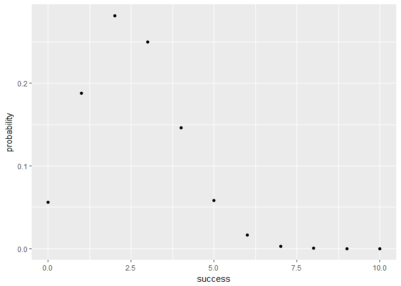
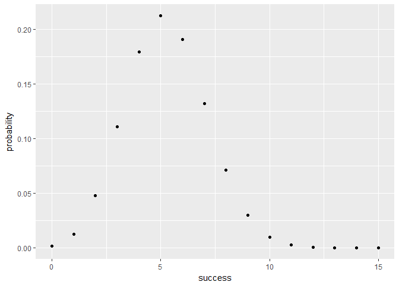

hw03-Renyi-Wang
================
Ren Yi Wang
March 22, 2018

#### 2) Pipelines and Redirection

    cd hw-stat133
    cd hw03
    curl -O https://raw.githubusercontent.com/ucb-stat133/stat133-spring-2018/master/data/nba2017-roster.csv

#### 2.1)

    cut -d "," -f 2 nba2017-roster.csv | tail +2 | sort -u > team-names.txt
    head -n 5 team-names.txt

    "ATL"
    "BOS"
    "BRK"
    "CHI"
    "CHO"

#### 2.2)

    cut -d "," -f 3 nba2017-roster.csv | tail +2 | sort -u > position-names.txt
    head -n 5 position-names.txt

    "C"
    "PF"
    "PG"
    "SF"
    "SG"

#### 2.3)

    cut -d "," -f 7 nba2017-roster.csv | tail +2 | sort -n | uniq -c > experience-counts.txt
    head -n 5 experience-counts.txt

         80 0
         52 1
         46 2
         36 3
         35 4

#### 2.4)

    grep "LAC" nba2017-roster.csv > LAC.csv
    cat LAC.csv

    "Alan Anderson","LAC","SF",78,220,34,7,1315448
    "Austin Rivers","LAC","SG",76,200,24,4,1.1e+07
    "Blake Griffin","LAC","PF",82,251,27,6,20140838
    "Brandon Bass","LAC","PF",80,250,31,11,1551659
    "Brice Johnson","LAC","PF",82,230,22,0,1273920
    "Chris Paul","LAC","PG",72,175,31,11,22868828
    "DeAndre Jordan","LAC","C",83,265,28,8,21165675
    "Diamond Stone","LAC","C",83,255,19,0,543471
    "J.J. Redick","LAC","SG",76,190,32,10,7377500
    "Jamal Crawford","LAC","SG",77,200,36,16,13253012
    "Luc Mbah a Moute","LAC","SF",80,230,30,8,2203000
    "Marreese Speights","LAC","C",82,255,29,8,1403611
    "Paul Pierce","LAC","SF",79,235,39,18,3500000
    "Raymond Felton","LAC","PG",73,205,32,11,1551659
    "Wesley Johnson","LAC","SF",79,215,29,6,5628000

#### 2.5)

    grep "LAL" nba2017-roster.csv | cut -d "," -f 6 | sort -n | uniq -c | cat

          2 19
          1 20
          2 22
          3 24
          2 25
          2 30
          2 31
          1 37

#### 2.6)

    grep -c "CLE" nba2017-roster.csv | cat

    15

#### 2.7)

    grep "GSW\|player" nba2017-roster.csv | cut -d "," -f 1,4,5 > gsw-height-weight.csv

    cat gsw-height-weight.csv
    "player","height","weight"
    "Andre Iguodala",78,215
    "Damian Jones",84,245
    "David West",81,250
    "Draymond Green",79,230
    "Ian Clark",75,175
    "James Michael McAdoo",81,230
    "JaVale McGee",84,270
    "Kevin Durant",81,240
    "Kevon Looney",81,220
    "Klay Thompson",79,215
    "Matt Barnes",79,226
    "Patrick McCaw",79,185
    "Shaun Livingston",79,192
    "Stephen Curry",75,190
    "Zaza Pachulia",83,270

#### 2.8)

    cut -d "," -f 1,8 nba2017-roster.csv | head -n 1 > intermediate.csv
    cut -d "," -f 1,8 nba2017-roster.csv | sort -t "," -k 2 -n -r >> intermediate.csv
    head -n 11 intermediate.csv > top10-salaries.csv
    cat top10-salaries.csv

    "player","salary"
    "LeBron James",30963450
    "Russell Westbrook",26540100
    "Mike Conley",26540100
    "Kevin Durant",26540100
    "James Harden",26540100
    "DeMar DeRozan",26540100
    "Al Horford",26540100
    "Carmelo Anthony",24559380
    "Damian Lillard",24328425
    "Dwyane Wade",23200000

#### Rmd file

``` r
source("code/binomial-functions.R")
library(ggplot2)

# Consider rolling a fair die 10 times, find the probability of getting exactly 3 sixes.
bin_probability(10, 3, 1/6)
```

    ## [1] 0.1550454

``` r
# distribution of the number of "sixes" when rolling a loaded die 10 times
binom1 <- bin_distribution(10, 0.25)
ggplot(binom1, aes(x = success, y = probability)) + 
  geom_point()
```



``` r
# the probability of getting more than 3 heads in 5 tosses with a biased coin of 35% chance of heads
ttl_prob = 0
for (i in 4:5) {
  ttl_prob = ttl_prob + bin_probability(5, i, 0.35)
}
ttl_prob
```

    ## [1] 0.0540225

``` r
# the probability distribution of the number of heads when tossing a loaded coin 15 times, with 35% chance of heads
binom2 <- bin_distribution(15, 0.35)

ggplot(binom2, aes(x = success, y = probability)) + 
  geom_point()
```


