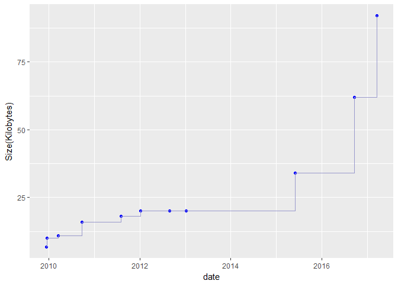
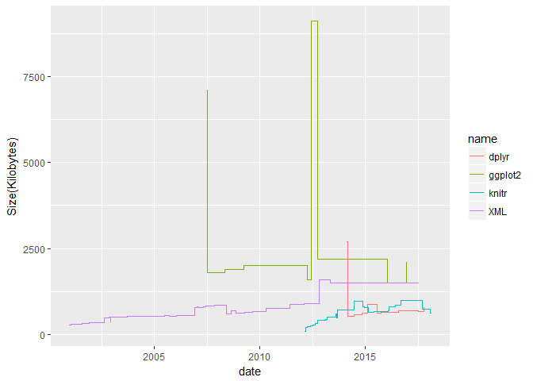
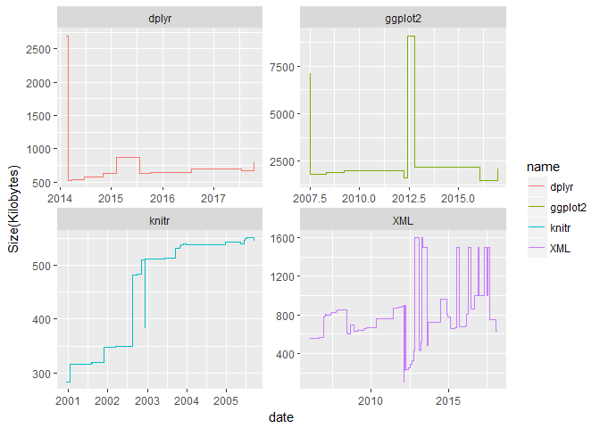
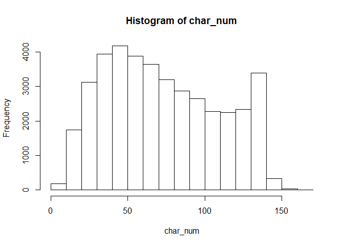
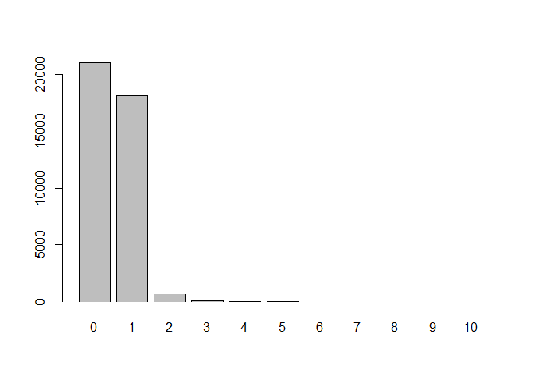
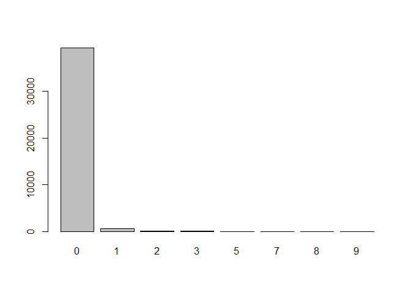

hw04-Renyi-Wang
================
Ren Yi Wang
April 13, 2018

``` r
library(stringr)
library(XML)
library(ggplot2)
source('../code/archive-functions.R')
knitr::opts_chunk$set(echo=TRUE, error=TRUE, fig.path='../images/')
```

1.1) Read Archive Data Table
----------------------------

``` r
raw_data <- read_archive('stringr')
```

    ## Error: failed to load external entity "http://cran.r-project.org/src/contrib/Archive/stringr"

``` r
raw_data
```

    ##                      Name    Last modified Size Description
    ## 1                    <NA>             <NA> <NA>        <NA>
    ## 2        Parent Directory                C    -           C
    ## 3   stringr_0.1.10.tar.gz 2009-11-09 16:57 6.8K           C
    ## 4      stringr_0.2.tar.gz 2009-11-16 20:25  10K           C
    ## 5      stringr_0.3.tar.gz 2010-02-15 18:06  11K           C
    ## 6      stringr_0.4.tar.gz 2010-08-24 16:33  16K           C
    ## 7      stringr_0.5.tar.gz 2011-06-30 19:12  18K           C
    ## 8    stringr_0.6.1.tar.gz 2012-07-25 21:59  20K           C
    ## 9    stringr_0.6.2.tar.gz 2012-12-06 08:40  20K           C
    ## 10     stringr_0.6.tar.gz 2011-12-08 20:02  20K           C
    ## 11   stringr_1.0.0.tar.gz 2015-04-30 11:48  34K           C
    ## 12   stringr_1.1.0.tar.gz 2016-08-19 21:02  62K           C
    ## 13   stringr_1.2.0.tar.gz 2017-02-18 21:23  92K           C
    ## 14                   <NA>             <NA> <NA>        <NA>

1.2) Data Cleaning
------------------

``` r
clean_data <- clean_archive(raw_data)
clean_data
```

    ##       name version        date size
    ## 1  stringr  0.1.10 2009-11-09   6.8
    ## 2  stringr     0.2 2009-11-16    10
    ## 3  stringr     0.3 2010-02-15    11
    ## 4  stringr     0.4 2010-08-24    16
    ## 5  stringr     0.5 2011-06-30    18
    ## 6  stringr   0.6.1 2012-07-25    20
    ## 7  stringr   0.6.2 2012-12-06    20
    ## 8  stringr     0.6 2011-12-08    20
    ## 9  stringr   1.0.0 2015-04-30    34
    ## 10 stringr   1.1.0 2016-08-19    62
    ## 11 stringr   1.2.0 2017-02-18    92

1.3) Timeline plot
------------------

``` r
plot_archive(clean_data)
```



1.4) Archive of "stringr"
-------------------------

``` r
raw_data <- read_archive('stringr')
clean_data <- clean_archive(raw_data)
plot_archive(clean_data)
```


1.5) Archives of "splyr", "ggplot2", "XML", and "knitr"
-------------------------------------------------------

``` r
raw_dplyr <- read_archive("dplyr")
raw_ggplot <- read_archive("ggplot2")
raw_xml <- read_archive("XML")
raw_knitr <- read_archive("knitr")

clean_dplyr <- clean_archive(raw_dplyr)
clean_ggplot <- clean_archive(raw_ggplot)
clean_xml <- clean_archive(raw_xml)
clean_knitr <- clean_archive(raw_knitr)

write.csv(clean_dplyr, '../data/dplyr-archive.csv', row.names = TRUE)
write.csv(clean_ggplot, '../data/ggplot2-archive.csv', row.names = TRUE)
write.csv(clean_xml, '../data/XML-archive.csv', row.names = TRUE)
write.csv(clean_knitr, '../data/knitr-archive.csv', row.names = TRUE)

merged_data <- rbind(clean_dplyr,clean_ggplot,clean_xml,clean_knitr)

years <- vector(mode = "numeric")
             
for (i in 1:length(merged_data$date)) {
    time <- as.numeric(str_split(merged_data$date,pattern = "-")[[i]])
    years[i] <- time[1] + time[2]/12 + time[3]/365 
}  

ggplot(merged_data, aes(x = years, y = as.numeric(merged_data$size))) +
  geom_step(aes(group = name, color = name)) +
  xlab('date') +
  ylab('Size(Kilobytes)')
```



``` r
ggplot(merged_data, aes(x = years, y = as.numeric(merged_data$size))) +
  geom_step(aes(color = name)) + 
  facet_wrap(~name, scales = 'free') +
  xlab('date') +
  ylab('Size(Kilobytes)')
```



2.1) Splitting Characters
-------------------------

``` r
source('../code/regex-functions.R')

split_chars('Go Bears!')
```

    ## [1] "G" "o" " " "B" "e" "a" "r" "s" "!"

``` r
split_chars('Expecto Patronum')
```

    ##  [1] "E" "x" "p" "e" "c" "t" "o" " " "P" "a" "t" "r" "o" "n" "u" "m"

2.2) Number of Vowels
---------------------

``` r
vec <- c('G', 'o', ' ', 'B', 'e', 'a', 'r', 's', '!')
num_vowels(vec)
```

    ## a e i o u 
    ## 1 1 0 1 0

2.3) Counting Vowels
--------------------

``` r
count_vowels("The quick brown fox jumps over the lazy dog")
```

    ## a e i o u 
    ## 1 3 1 4 2

``` r
count_vowels("THE QUICK BROWN FOX JUMPS OVER THE LAZY DOG")
```

    ## a e i o u 
    ## 1 3 1 4 2

2.4) Reversing Characters
-------------------------

``` r
reverse_chars("gattaca")
```

    ## [1] "acattag"

``` r
reverse_chars("Lumox Maxima")
```

    ## [1] "amixaM xomuL"

2.5) Reversing Sentences by Words
---------------------------------

``` r
reverse_words("sentence! this reverse")
```

    ## [1] "reverse this sentence!"

``` r
reverse_words("string")
```

    ## [1] "string"

3.1) Number of characters per tweet
-----------------------------------

``` r
text <- read.csv('../data/text-emotion.csv')

content_vec <- as.vector(text$content)
char_num <- vector(mode = 'numeric')

for (i in 1:length(text$content)) {
  char_num[i] <- length(split_chars(content_vec[i]))
}

summary(char_num)
```

    ##    Min. 1st Qu.  Median    Mean 3rd Qu.    Max. 
    ##    1.00   43.00   69.00   73.41  103.00  167.00

``` r
hist(char_num)
```



3.2) Number of Mentions
-----------------------

``` r
num_at <- str_count(text$content, pattern = '@[a-zA-Z0-9_]{1,15}')
at_table <- table(num_at)
barplot(at_table)
```



``` r
vec_10_more <- num_at == 10
text$content[vec_10_more]
```

    ## [1] last #ff  @Mel_Diesel @vja4041 @DemonFactory @shawnmcguirt @SEO_Web_Design @ChuckSwanson @agracing @confidentgolf @tluckow @legalblonde31
    ## 39827 Levels: 'Allo there twitter  how are we today? ...

3.3) Hashtags
-------------

``` r
num_hash <- str_count(text$content, pattern = '#[[:alpha:]][[:alnum:]]*')
sum(num_hash)
```

    ## [1] 880

``` r
hash_table <- table(num_hash)
barplot(hash_table)
```



``` r
hash_vec <- na.omit(str_extract(text$content, pattern = '#[[:alpha:]][[:alnum:]]*'))
hash_length <- nchar(hash_vec) - 1
len_avg <- mean(hash_length)
len_avg
```

    ## [1] 7.714479

``` r
hashtag_table <- table(hash_length)
mode <- names(hashtag_table[hashtag_table == max(hashtag_table)])
mode
```

    ## [1] "4"
