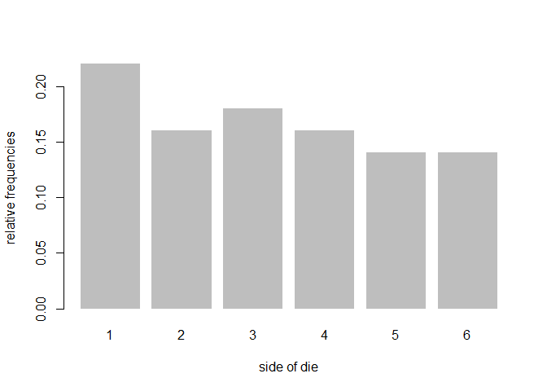
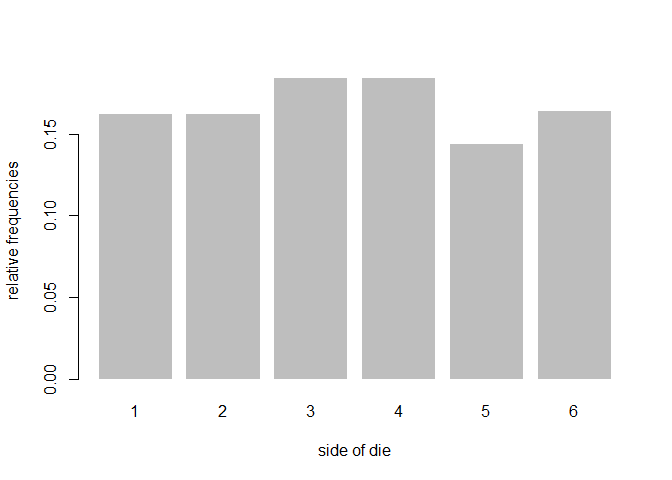

hw05-Renyi-Wang
================
Ren Yi Wang
April 21, 2018

``` r
knitr::opts_chunk$set(echo = TRUE, error = TRUE)
```

1) Object "die"
---------------

``` r
# aux function checking sides
check_sides <- function(sides) {
  if (length(sides) != 6) {
    stop('\n sides must be of length 6')
  }
  return(TRUE)
}

# aux function checking probabilities
check_prob <- function(prob) {
  if (length(prob) != 6 | is.numeric(prob) == FALSE) {
    stop('\n prob must be a numeric vector of length 6')
  }
  
  if (any(prob < 0) | any(prob > 1)) {
    stop('\n prob must be between 0 and 1, inclusive')
  }
  
  if (sum(prob) != 1) {
    stop('\n elements in prob must add up to 1')
  }
  
  return(TRUE)
}

# class constructor function for die
die <- function(sides = 1:6, prob = rep(1/6, 6)) {
  check_sides(sides)
  check_prob(prob)
  
  object = list('sides' = sides, 'prob' = prob)
  class(object) <- 'die'
  
  return(object)
}

# print method for object of class "toss"
print.die <- function(object) {
  object <- data.frame('sides' = object$sides,
                       'prob' = object$prob,
                       stringAsFactors = FALSE)
  cat('object "die"', '\n\n')
  print(object)
  invisible(object)
}


# default call: creates a standard fair die
fair_die <- die()
fair_die
```

    ## object "die" 
    ## 
    ##   sides      prob stringAsFactors
    ## 1     1 0.1666667           FALSE
    ## 2     2 0.1666667           FALSE
    ## 3     3 0.1666667           FALSE
    ## 4     4 0.1666667           FALSE
    ## 5     5 0.1666667           FALSE
    ## 6     6 0.1666667           FALSE

``` r
# die with non-standard sides
weird_die <- die(sides = c('i', 'ii', 'iii', 'iv', 'v', 'vi'))
weird_die
```

    ## object "die" 
    ## 
    ##   sides      prob stringAsFactors
    ## 1     i 0.1666667           FALSE
    ## 2    ii 0.1666667           FALSE
    ## 3   iii 0.1666667           FALSE
    ## 4    iv 0.1666667           FALSE
    ## 5     v 0.1666667           FALSE
    ## 6    vi 0.1666667           FALSE

``` r
# create a loaded die
loaded_die <- die(prob = c(0.075, 0.1, 0.125, 0.15, 0.20, 0.35))
loaded_die
```

    ## object "die" 
    ## 
    ##   sides  prob stringAsFactors
    ## 1     1 0.075           FALSE
    ## 2     2 0.100           FALSE
    ## 3     3 0.125           FALSE
    ## 4     4 0.150           FALSE
    ## 5     5 0.200           FALSE
    ## 6     6 0.350           FALSE

``` r
# bad sides
bad_die <- die(sides = c('a', 'b', 'c', 'd', 'e'))
```

    ## Error in check_sides(sides): 
    ##  sides must be of length 6

``` r
# bad prob
bad_die <- die(
sides = c('a', 'b', 'c', 'd', 'e', 'f'),
prob = c(0.2, 0.1, 0.1, 0.1, 0.5, 0.1))
```

    ## Error in check_prob(prob): 
    ##  elements in prob must add up to 1

2) Object "roll"
----------------

``` r
# aux function checking times
check_times <- function(times) {
  if (times%%1 != 0 | times <= 0)
    stop('\n times must be a positive integer')
  return(TRUE)
}

roll <- function(x, ...) UseMethod("roll")
roll.die <- function(die, times = 1) {
  check_times(times)
  rolls <- sample(die$sides, size = times, replace = TRUE, prob = die$prob)
  rolls <- list('rolls' = rolls,
                'sides' = die$sides,
                'prob' = die$prob,
                'total' = times)
  class(rolls) <- 'roll'
  return(rolls)
}

print.roll <- function(rolls) {
  rolls <- data.frame('rolls' = rolls$rolls, stringsAsFactors = FALSE)
  cat('object "roll"', '\n\n')
  cat('$rolls', '\n')
  print(rolls$rolls)
  invisible(rolls)
}

# roll fair die 50 times
fair_die <- die()
set.seed(123)
fair50 <- roll(fair_die, times = 50)
fair50
```

    ## object "roll" 
    ## 
    ## $rolls 
    ##  [1] 3 6 4 1 1 2 5 1 5 4 1 4 6 5 2 1 3 2 3 1 1 6 5 1 5 6 5 5 3 2 1 1 6 6 2
    ## [36] 4 6 3 3 3 2 4 4 4 2 2 3 4 3 1

``` r
# what's in fair50?
names(fair50)
```

    ## [1] "rolls" "sides" "prob"  "total"

``` r
fair50$rolls
```

    ##  [1] 3 6 4 1 1 2 5 1 5 4 1 4 6 5 2 1 3 2 3 1 1 6 5 1 5 6 5 5 3 2 1 1 6 6 2
    ## [36] 4 6 3 3 3 2 4 4 4 2 2 3 4 3 1

``` r
fair50$sides
```

    ## [1] 1 2 3 4 5 6

``` r
fair50$prob
```

    ## [1] 0.1666667 0.1666667 0.1666667 0.1666667 0.1666667 0.1666667

``` r
fair50$total
```

    ## [1] 50

``` r
# string die
str_die <- die(sides = c('a', 'b', 'c', 'd', 'e', 'f'),
               prob = c(0.075, 0.1, 0.125, 0.15, 0.20, 0.35))

# roll 20 times
set.seed(123)
str_rolls <- roll(str_die, times = 20)
names(str_rolls)
```

    ## [1] "rolls" "sides" "prob"  "total"

``` r
str_rolls
```

    ## object "roll" 
    ## 
    ## $rolls 
    ##  [1] "f" "c" "e" "b" "a" "f" "e" "b" "d" "e" "a" "e" "d" "d" "f" "b" "f"
    ## [18] "f" "f" "a"

3) Summary method for "roll" objects
------------------------------------

``` r
# summary function for class roll
summary.roll <- function(rolls) {
  roll_table_df <- data.frame(table(rolls$rolls), stringsAsFactors = FALSE)
  roll_count <- roll_table_df$Freq
  roll_prop <- roll_count/rolls$total
  roll_df <- data.frame('freqs' = c(as.character(rolls$sides),
                                    as.character(roll_count),
                                    as.character(roll_prop)),
                        stringsAsFactors = FALSE)
  class(roll_df) <- 'summary.roll'
  return(roll_df)
}

# print method for roll summary
print.summary.roll <- function(df) {
  df_len <- length(df$freqs)
  df <- data.frame('side' = df$freqs[1:(df_len/3)],
                   'count' = df$freqs[((df_len/3)+1):((2*df_len)/3)],
                   'prop'= df$freqs[((2*df_len/3)+1):df_len])
  cat('summary "roll"', '\n\n')
  print(df)
  invisible(df)
}

set.seed(123)
fair_50rolls <- roll(fair_die, times = 50)
fair50_sum <- summary(fair_50rolls)
fair50_sum
```

    ## summary "roll" 
    ## 
    ##   side count prop
    ## 1    1    11 0.22
    ## 2    2     8 0.16
    ## 3    3     9 0.18
    ## 4    4     8 0.16
    ## 5    5     7 0.14
    ## 6    6     7 0.14

``` r
# what's in the summary
class(fair50_sum)
```

    ## [1] "summary.roll"

``` r
names(fair50_sum)
```

    ## [1] "freqs"

4) Plot methd for "roll" objects
--------------------------------

``` r
# plot method
plot.roll <- function(rolls) {
  barplot(table(rolls$rolls)/rolls$total, xlab = 'side of die', ylab = 'relative frequencies', border = NA)
}


# plot method
plot(fair_50rolls)
```



5) Additional Methods
---------------------

``` r
# extraction method "[" to extract the value of a given roll
'[.roll' <- function(rolls, i) {
  return(rolls$rolls[i])
}

# replacement method "[<-" to replace the value of a given roll
'[<-.roll' <- function(rolls, i, value) {
  if (i < 1 | i > rolls$total) {
    stop('\n index out of bounds')
  }
  
  if (value %in% rolls$sides == FALSE) {
    stop('\n invalid replacing value')
  }
  
  rolls$rolls[i] <- value
  new_rolls <- list('rolls' = rolls$rolls,
                'sides' = rolls$sides,
                'prob' = rolls$prob,
                'total' = rolls$total)
  class(new_rolls) <- 'roll'
  return(new_rolls)
}

# addition method
'+.roll' <- function(rolls, increment) {
  if (length(increment) != 1 | increment <= 0 | increment%%1 != 0) {
    stop('\n increment must be a positive integer')
  }
  
  origin_sides <- rolls$sides
  origin_rolls <- rolls$rolls
  origin_prob <- rolls$prob
  origin_total <- rolls$total
  
  origin_die <- list('sides' = origin_sides, 'prob' = origin_prob)
  class(origin_die) <- 'die'
  
  add_rolls <- roll(origin_die, times = increment)

  new_rolls <- list('rolls' = c(origin_rolls, add_rolls$rolls),
                    'sides' = rolls$sides,
                    'prob' = rolls$prob,
                    'total' = origin_total + increment)
  class(new_rolls) <- 'roll'
  return(new_rolls)
}

# roll fair die
set.seed(123)
fair_die <- die()
fair500 <- roll(fair_die, times = 500)
# summary method
summary(fair500)
```

    ## summary "roll" 
    ## 
    ##   side count  prop
    ## 1    1    80  0.16
    ## 2    2    81 0.162
    ## 3    3    92 0.184
    ## 4    4    92 0.184
    ## 5    5    72 0.144
    ## 6    6    83 0.166

``` r
# extracting roll in position 500
fair500[500]
```

    ## [1] 6

``` r
# replacing last roll
fair500[500] <- 1
fair500[500]
```

    ## [1] 1

``` r
summary(fair500)
```

    ## summary "roll" 
    ## 
    ##   side count  prop
    ## 1    1    81 0.162
    ## 2    2    81 0.162
    ## 3    3    92 0.184
    ## 4    4    92 0.184
    ## 5    5    72 0.144
    ## 6    6    82 0.164

``` r
# adding 100 rolls
fair600 <- fair500 + 100
summary(fair600)
```

    ## summary "roll" 
    ## 
    ##   side count              prop
    ## 1    1   100 0.166666666666667
    ## 2    2    97 0.161666666666667
    ## 3    3   104 0.173333333333333
    ## 4    4   109 0.181666666666667
    ## 5    5    91 0.151666666666667
    ## 6    6    99             0.165

``` r
# plot method
plot(fair500)
```



De Mere's Problem
-----------------

#### Problem 1

``` r
library(dieroller)
```

    ## 
    ## Attaching package: 'dieroller'

    ## The following objects are masked _by_ '.GlobalEnv':
    ## 
    ##     check_prob, check_sides, check_times, die, plot.roll,
    ##     print.die, print.roll, print.summary.roll, roll, roll.die,
    ##     summary.roll

``` r
count <- 0
fair_die <- die()
for (i in 1:1000) {
  single_roll <- roll(fair_die, 4)$rolls
  if(any(single_roll == 6)) {
    count <- count + 1
  }
}
prob <- count/1000
prob
```

    ## [1] 0.526

#### Problem 2

``` r
count <- 0
die1 <- die()
die2 <- die()

for (i in 1:1000) {
  roll1 <- roll(die1, 24)$rolls
  roll2 <- roll(die2, 24)$rolls
  combined_roll <- roll1 + roll2
  
  if (any(combined_roll == 12)) {
    count <- count + 1
  }
}

prob <- count/1000
prob
```

    ## [1] 0.469
