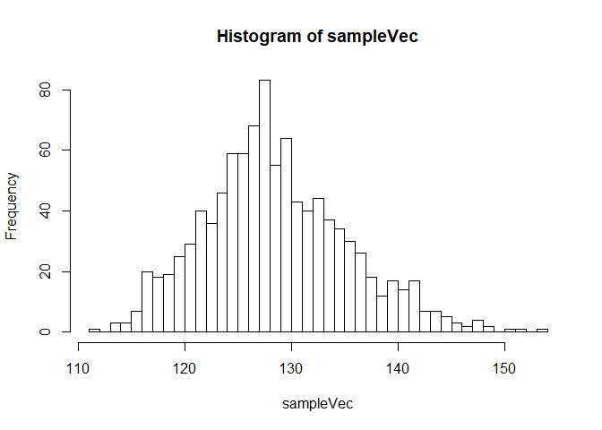
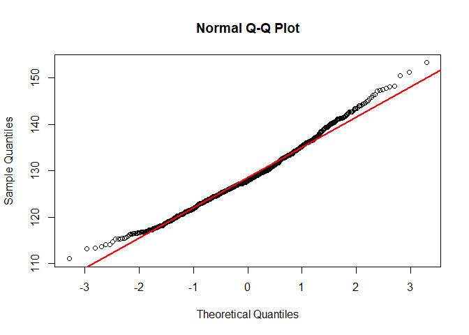
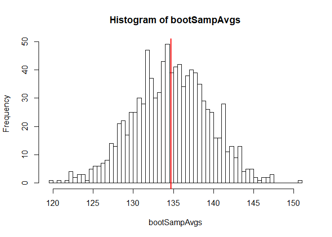
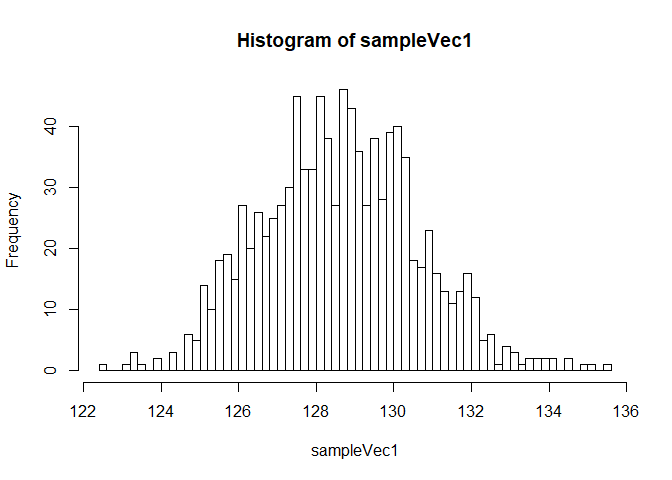
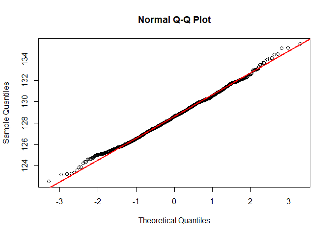
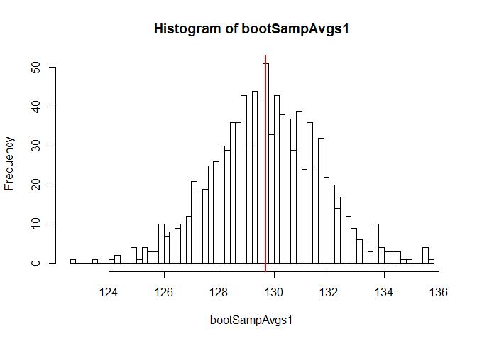

Stat135\_lab\_1
================
Ren Yi Wang
February 10, 2018

<font size = "5">

Part 1 a
--------

``` r
load("/Users/user/Desktop/Stat 135/Stat 135 lab/Lab01/KaiserBabies.rda")
set.seed(7)

n <- 10
N <- length(na.omit(infants$wt))

mySample <- sample(na.omit(infants$wt), n)
sampleAverage <- mean(mySample)

# Calculate the 95% interval
estimatedSE <- sqrt((1-(n/N))*var(mySample)/n)
lowerBound <- sampleAverage-1.96*estimatedSE
upperBound <- sampleAverage+1.96*estimatedSE
```

My sample average is 134.7, and my estimated SE is 4.8921697. The 95% confidence interval is (125.1113474, 144.2886526), under the assumption that normality works.

Part 1 b
--------

``` r
# Sample 1000 times
sampleVec <- matrix(0, 1, 1000)
record <- matrix(0, 2, 1000)
for (i in 1:1000)
{
  repeatedSample <- sample(na.omit(infants$wt), n)
  repSampleAve <- mean(repeatedSample)
  newEstimatedSE <- sqrt((1-(n/N))*var(repeatedSample)/n)
  sampleVec[1, i] <- repSampleAve
  record[1, i] <- repSampleAve-1.96*newEstimatedSE
  record[2, i] <- repSampleAve+1.96*newEstimatedSE
}

# Calculate the true average in population (exclude na)
trueAverage <- mean(na.omit(infants$wt))

# Cound number of invervals covering true average
coverNumber <- 0
for (k in 1:1000)
{
  if (record[1, k] < trueAverage && trueAverage < record[2, k])
    coverNumber <- coverNumber + 1
  else
    coverNumber <- coverNumber
}
```

I expect 950 inervals to cover the true population average, and 885 of my confidence intervals cover true popultion average.

Part 1 c
--------

``` r
sampleSD <- sd(sampleVec)
hist(sampleVec, breaks = 50)
```



``` r
qqnorm(sampleVec)
qqline(sampleVec, col = "red", lwd = 2)
```



The SD of sample average is 6.7403715, and it is not quite similar to my estimated SE in part a. From my qqplot, sample average is close to the red line, and thus it is close to a normal distribution. Since sample average is close to normal distribution, the confidence interval is valid.

Part 2 a
--------

``` r
# Bootstrap function
bootStrap = function(mySample, popSize = 1236, B = 1000, replace =
              FALSE)
{
  if (replace) 
    return(replicate(B, mean(sample(mySample, length(mySample),
      TRUE))))
  else 
    vals = sort(unique(mySample))
    counts = table(mySample)
    bootPop = rep(vals, round(counts * popSize / length(mySample)))
    return(list(bootPop, 
      bootSamps = replicate(B,mean(sample(bootPop, 
        length(mySample), FALSE)))))
}

bootSampAvgs <- bootStrap(mySample)$bootSamps
hist(bootSampAvgs, breaks = 50)
abline(v = mean(bootStrap(mySample)[[1]]),col = "red", lwd = 2)
```



``` r
bootSD <- sd(bootSampAvgs)
```

The SD of sample average is 4.7129897, and it is close to the estimated SE in part 1 a.

Part 2 b
--------

``` r
# Contruct 95% confidence interval
bootLowerBound <- unname(quantile(bootSampAvgs, 0.025))
bootUpperBound <- unname(quantile(bootSampAvgs, 0.975))
```

My 95% confidence interval is (125.2975, 143.5025), and it is close to the confidence interval I have in part 1 a.

Part 3.1.a
----------

``` r
set.seed(7)

n1 <- 100

mySample1 <- sample(na.omit(infants$wt), n1)
sampleAverage1 <- mean(mySample1)

# Calculate the 95% interval
estimatedSE1 <- sqrt((1-(n1/N))*var(mySample1)/n1)
lowerBound1 <- sampleAverage1-1.96*estimatedSE1
upperBound1 <- sampleAverage1+1.96*estimatedSE1
```

My sample average is 129.78, and my estimated SE is 1.9715842. The 95% confidence interval is (125.9156949, 133.6443051).

Part 3.1.b
----------

``` r
# Sample 1000 times
sampleVec1 <- matrix(0, 1, 1000)
record1 <- matrix(0, 2, 1000)
for (i in 1:1000)
{
  repeatedSample1 <- sample(na.omit(infants$wt), n1)
  repSampleAve1 <- mean(repeatedSample1)
  newEstimatedSE1 <- sqrt((1-(n1/N))*var(repeatedSample1)/n1)
  sampleVec1[1, i] <- repSampleAve1
  record1[1, i] <- repSampleAve1-1.96*newEstimatedSE1
  record1[2, i] <- repSampleAve1+1.96*newEstimatedSE1
}

# Cound number of invervals covering true average
coverNumber1 <- 0
for (k in 1:1000)
{
  if (record1[1, k] < trueAverage && trueAverage < record1[2, k])
    coverNumber1 <- coverNumber1 + 1
  else
    coverNumber1 <- coverNumber1
}
```

I expect 950 inervals to cover the true population average. 949 of my confidence intervals cover true popultion average.

Part 3.1.c
----------

``` r
sampleSD1 <- sd(sampleVec1)
hist(sampleVec1, breaks = 50)
```



``` r
qqnorm(sampleVec1)
qqline(sampleVec1, col = "red", lwd = 2)
```



The SD of sample average is 2.000529, and it is quite similar to my estimated SE in part a. From my qqplot, sample average is close to the red line, and thus it is close to a normal distribution. Since sample average is close to normal distribution, the confidence interval is valid.

Part 3.2.a
----------

``` r
bootSampAvgs1 <- bootStrap(mySample1)$bootSamps
hist(bootSampAvgs1, breaks = 50)
abline(v = mean(bootStrap(mySample1)[[1]]),col = "red", lwd = 2)
```



``` r
bootSD1 <- sd(bootSampAvgs1)
```

The SD of sample average is 1.9517933, and it is close to the estimated SE in part 3.1.a.

Part 3.2.b
----------

``` r
# Contruct 95% confidence interval
bootLowerBound1 <- unname(quantile(bootSampAvgs1, 0.025))
bootUpperBound1 <- unname(quantile(bootSampAvgs1, 0.975))
```

My 95% confidence interval is (125.88975, 133.67025), and it is close to the confidence interval I have in part 3.1.a.
