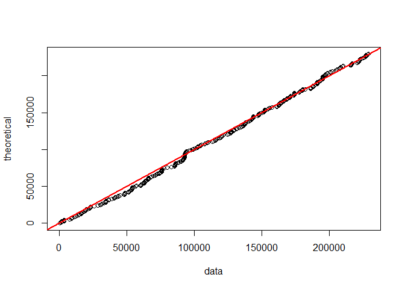
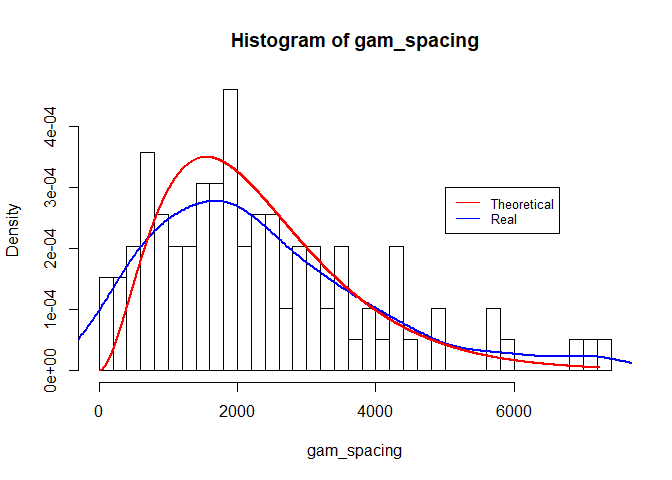
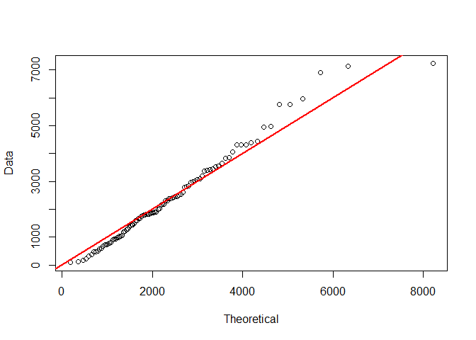
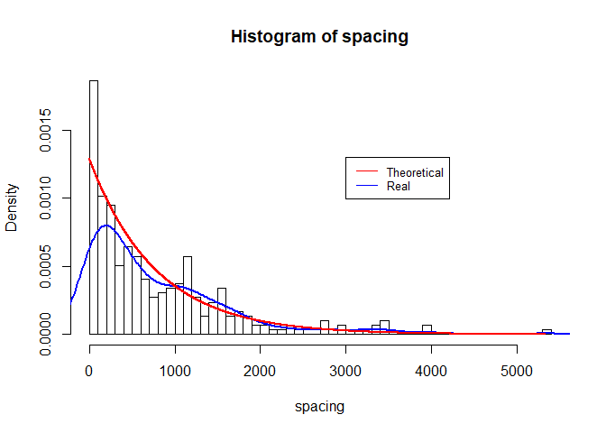
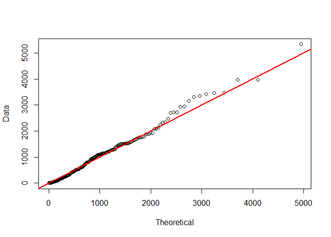
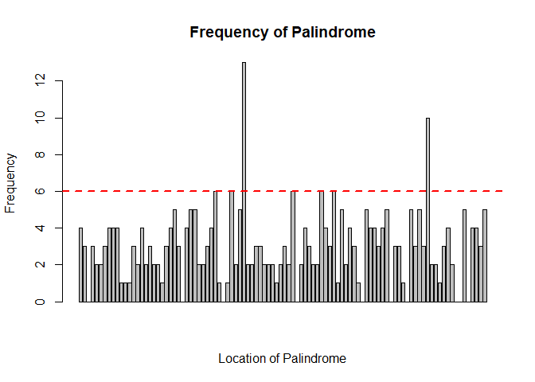

Analysis of HCMV's Origin of Replication
================
Ren Yi Wang
March 17, 2018

#### Introduction

The human cytomegalovirus (CMV) is a kind of disease that is especially deadly for people with deficient immune systems. In order to find a cure to CMV, we must find out how CMV replicates. More specifically, we are more interested in finding special intervals on the virus' DNA that contain infromation about replication. The special interval is called the origin of replication. One characteristic of origin of replication is that it contains clusters of complimentary palindromes. The data in this lab contains 296 locations of palindromes with length between 10 and 18 on 229354 base pairs.

#### Objectives

Thie lab aims to answer the following questions:
1. Is homogeneous Poisson process a reasonalbe model for our data? 2. Can we identify unusual clusters (origin of replication)?

#### Methods

This lab includes *χ*2 test and Kolmogorov-Smirnov test.
For *χ*2 test: *df* = m-k-1 = 8-1-1 = 6, where k is the number of estimated parameter.
Test statistics = $\\chi^2 = \\sum\_{k=1}^{n} \\frac{(O\_k - E\_k)^2}{E\_k}$.
*p*-value is calculated by R function `pchisq()`.
For Kolmogorov-Smirnov test:
*p*-value is directly obtained by R function `ks.test()`.

#### Preliminary Step: Observation

The following is the qqplot of locations of palindormes, and the red line is the theoretical quantile of the uniform distribution.

By observing the qqplot of the data, the distribution of palindrome location is quite uniformly distributed. In order to further investigate if uniform distribution fits our data, we can set up hypotheses:

*H*0: The location is uniformly distributed.
*H**A*: The location is not uniformly distributed.

To test it, I separate the base pairs into 15 groups and produce a table of observed and expected counts in the groups. I separate the base pairs into 15 groups to obtain a good variety of number of counts. By increasing the variety of observed counts, I can extract more information from the data. However, I do not want to divide the base pairs into too many groups since the I only want general behavior of the data during this preliminary step.

       Observed.counts Expected.counts
    1               16        19.73333
    2               17        19.73333
    3               17        19.73333
    4               19        19.73333
    5               27        19.73333
    6               16        19.73333
    7               26        19.73333
    8               17        19.73333
    9               20        19.73333
    10              24        19.73333
    11              17        19.73333
    12              19        19.73333
    13              28        19.73333
    14              12        19.73333
    15              21        19.73333

After performing *χ*2 test with *df* = 15-1 = 14, and test statistics = 15.1486486. My *p*-value is 0.3680693, which exceeds the significance leval of 0.05, meaning that I fail to reject *H*0. Therefore, the location of palindromes is colse to the uniform distribution, and the homogeneous Poisson process is a good candidate for further investigation.

#### Homogeneous Poisson Process

Since the location of palindromes is quite uniformly distributed, I assume the rate of palindrome, *λ*, is invariant with respect to location. According to the context of the experiment, no two palindromes can occur at the same location, and the occurence of palindromes are independent of each other. With all conditions satisfied, the occurence of palindrome can be modeled by homogeneous Poisson process.

#### Distribution for Number of Counts

In homogeneous Poisson model, the number of counts in an interval follows Poisson distribution with *λ* = 296/60 = 4.933333 because I partition data into 60 groups of 3822 base pairs. I choose 3822 as my interval length to avoid the chance of getting a huge proportion of zeros, and dividing the data into 60 groups quadruples the resolution of my observation compared with my partition in the preliminary step. In addition, my partition covers all occurences of palidromes in the data. Now, set up hypotheses:

*H*0: The count of palindrome follows Poisson distribtuion.
*H**A*: The count of palindrome does not follow Poisson distribtuion.

       Observed.counts Expected.counts
    1                4        2.131927
    2                6        5.258754
    3                8        8.647727
    4               10       10.665530
    5               10       10.523322
    6                5        8.652509
    7               11        6.097958
    8+               6        7.590126

After performing *χ*2 test with *df* = 8-1-1 = 6 (*λ* is estimated), and test statistics = 7.6730656. My *p*-value is 0.263047, which exceeds the significance leval of 0.05, meaning that I fail to reject *H*0. Therefore, Poisson distribution is a reasonable model for number of counts in interval of 3822 base pairs.

#### Spacing of Palindromes

Gamma and exponential distribution is another useful distribution derived from homogeneous poisson distribution. Modeling the spacing between three adjacent palindromes allows us to investigate the data with highter resolution compared with the Poisson distribution part.

1.  Gamma distribution

I first fit the spacing between 4 palindromes by Gamma(3,*λ*) with *λ* = 296/229354 = 0.001290581. My partition is (0,3), (3,6)... instead of (0,3), (1,4)... because the latter partition uses data repeatedly, making those events not independent. The following are histogram and qqplot of spacing between 4 palindromes.

According to the histogram, the spacing between 4 palindromes behaves somewhat similar to the theoretical distribution. However, the qqplot does not quite fit my data. To obtain a more precise conclusion, set up the hypotheses:

*H*0: The spacing between 4 palindromes follows Gamma(3,*λ*) distribtuion.
*H**A*: The spacing between 4 palindromes does not follow Gamma(3,*λ*) distribtuion.

Kolmogorov-Smirnov test is preferred in this case since there is a great variety of spacings, and method of grouping required in *χ*2 test can affect our *p*-value unpredictably. After performing the K-S test, the *p*-value = 0.2748792, which exceeds the significance leval *α* = 0.05. Therefore, I fail to reject *H*0, and the distance between three hits that are three apart might be modeled by Gamma(3,*λ*) distribution, which implies that the palindromes are quite equally spread without big clusters. However, spacing between 4 palindromes is not sensitive enough to detect the occurrence of small clusters and further investigation is needed to test if there are small clusters.

1.  Exponential distribution

In order to check if ther is any small cluster of palindromes that might be the origin of replication. I fit the spacing between 2 palindromes into exponential distribution with *λ* = 296/229354 = 0.001290581. The following are histogram and qqplot of spacing between 2 palindromes.

According to the histogram, the theoretical curve somewhat matches with the data curve, but there is discrepancy between theretical quantile and data quantile. To answer weather exponential distribution fits the distribution of spacing between 2 palindromes, set up hypotheses:

*H*0: The spacing between 2 palindromes follows Exp(*λ*) distribtuion.
*H**A*: The spacing between 2 palindromes does not follow Exp(*λ*) distribtuion.

Analogously, K-S test is preferred in this case since the spacing between 2 palindromes ranges form 1 to 5333, and different method of grouping can result in different *p*-value for *χ*2 test. After performing K-S test, *p*-value is 0.0196063, which is less than the significant level *α* = 0.05. Therefore, *H*0 is rejected, meaning the exponential distribution is not a good fit for spacing between 2 palindromes. From the result of my hypothesis test, I suspect that there are small clusters in our data.

#### Maximum Number of Hits

To locate intervals where unusual dense clusters are located, I first plot the barplot with 100 groups:

From the histogram, intervals that have more than 6 hits are unusual, and I want to further check the if probability of having more than 6 hits in an interval on length 2293 is less than singnificance level *α* = 0.05. To do so, set up hypotheses:

*H*0: The intervals that have more than 6 hits are not unusual.
*H**A*: The intervals that have more than 6 hits are unusual.

Here, the distirbution of number of hits in an interval with length 2293 can be modeled by the Poisson distribution with rate *λ* = 296/100 = 2.96 according to the conclusion from previous part. The probability of having more than 6 hits in an interval is 0.0315323, which is less than the significance level *α* = 0.05. Therefore, by Fisher's exact test, I reject *H*0 and conclude that those intervals are likely to be origin of replication. The intervals that have more than 6 hits are the 41th and 86th interval, meaning the origins of replication are likely to happen in locations from 91721 to 94013, and from 194906 to 197198.

#### Conclusion

After applying several models on the data and investigating its property at different resolutions, I conclude that the rate of occurrence of palindromes can be modeled by uniform distribution, and the counts in interval with length around 3822 can be modeled by Poisson distribution. The spacing between 2 palindromes does not fit exponential distribution, and thus there should be some clusters. Intervals of length 2293 with more than 6 hits are ususual, making them highly suspicious to be the origins of replication. Finally, locations from 91721 to 94013, and from 194906 to 197198 are highly possible to be the origin of replication.
