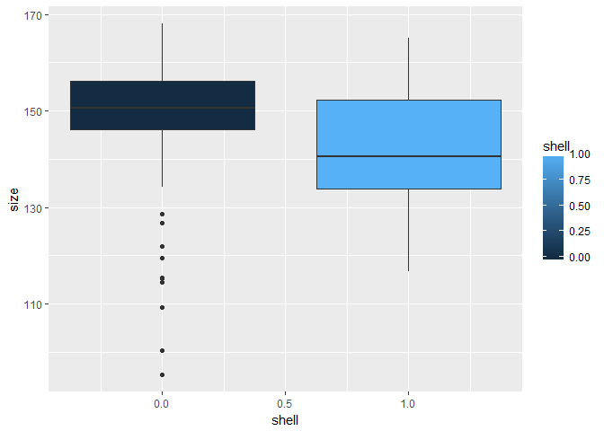
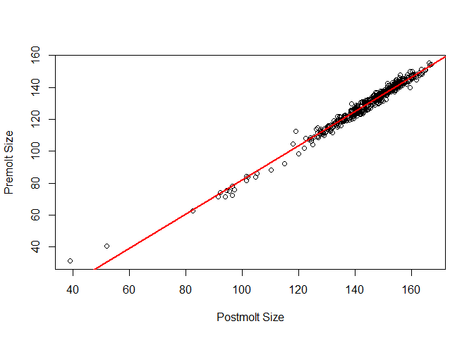
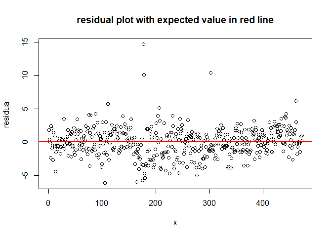
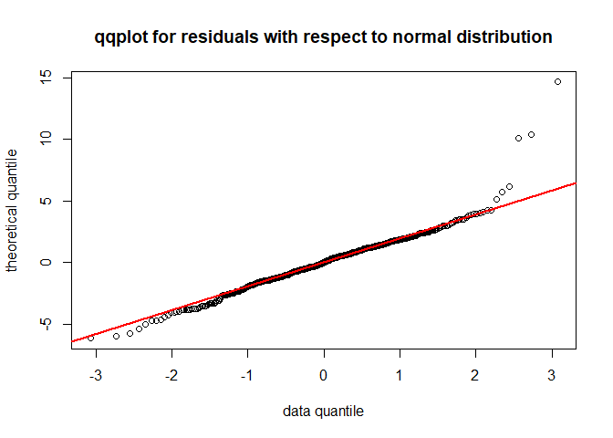
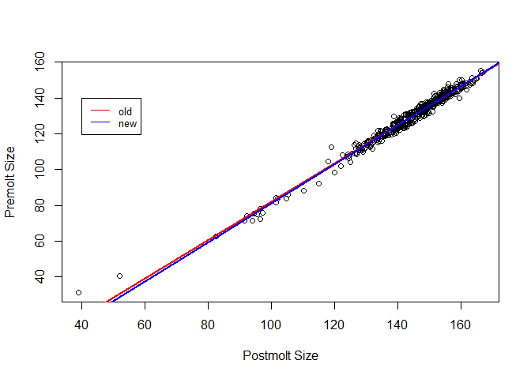
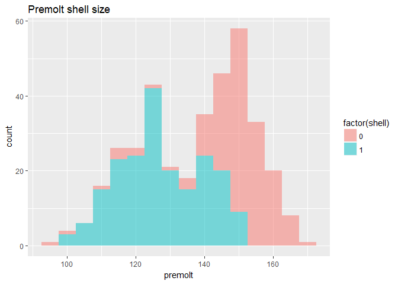

Stat 135 lab 03
================
Ren Yi Wang
April 23, 2018

<font size = 4>

``` r
# read data into workspace
molt <- read.csv('crabmolt.csv')
pop <- read.csv('crabpop.csv')
```

1.a)
----

``` r
library(ggplot2)
library(dplyr)
```

    ## 
    ## Attaching package: 'dplyr'

    ## The following objects are masked from 'package:stats':
    ## 
    ##     filter, lag

    ## The following objects are masked from 'package:base':
    ## 
    ##     intersect, setdiff, setequal, union

``` r
ggplot(data = pop, aes(x = shell, y = size, group = shell)) +
  geom_boxplot(aes(fill = shell))
```



This is an interesting plot since it shows that the crabs with fouled carapace are generally larger than the carbs that have clean carapace (accoring to the average in the boxplot). The sizes of crabs with fouled carapace fall mainly between 140 to 160, whereas the sizes of crabs with clean carapace fall mainly between 135 to 155. Fianlly, the range of crab sizes with fouled carapace are smaller, and one possible reason might be that those crabs having fouled carapace are older than those crabs with clean carapace.

1.b)
----

``` r
fouled_shell <- filter(pop, shell == 0)
clean_shell <- filter(pop, shell == 1)

fouled_shell_sd <- sd(fouled_shell$size)
clean_shell_sd <- sd(clean_shell$size)
fouled_shell_sd
```

    ## [1] 11.27015

``` r
clean_shell_sd
```

    ## [1] 11.39792

``` r
summary(fouled_shell$size)
```

    ##    Min. 1st Qu.  Median    Mean 3rd Qu.    Max. 
    ##    95.4   146.1   150.6   149.1   156.1   168.0

``` r
summary(clean_shell$size)
```

    ##    Min. 1st Qu.  Median    Mean 3rd Qu.    Max. 
    ##   116.8   133.9   140.6   142.1   152.2   165.1

From the numerical summary above, the standard deviations for crab sizes with fouled shell and with clean shells are close to each other. However, the mean and medians are quite different from each other, indicating that the sizes for crabs with clean and fouled shells might have a different distribution. Finally, notice that the range for crabs with fouled and clean shells are very different.

2
-

``` r
y <- molt$presz
x <- molt$postsz
fit_y <- lm(y~x)
```

If we want to build a linear regression model to predict the premolt size of a female adult crab, we need to set up the standard statistical model *Y*<sub>*i*</sub> = *a* + *b**x*<sub>*i*</sub> + *e*<sub>*i*</sub>. Here, the response variables *Y*<sub>*i*</sub>′*s* are the premolt size, explanatory variables *x*<sub>*i*</sub>′*s* are postmolt sizes, and random variables *e*<sub>*i*</sub>′*s* are errors. If we minimize ∑*e*<sub>*i*</sub><sup>2</sup> with respect to a and b, we will get $\\hat{b} = \\frac{\\sum(x\_i - \\bar{s}) (Y\_i - \\bar{Y})} {\\sum(x\_i - \\bar{x})^2}$ = 1.0731624 and $\\hat{a} = \\bar{Y} - b \\bar{x}$ = -25.2137027. Notice that *Y*<sub>*i*</sub> is a random variable, whereas *x*<sub>*i*</sub> is a fixed value. Now, we have a regression line $y = \\hat{a} + \\hat{b}x$.

3)
--

``` r
plot(x,y, xlab = 'Postmolt Size', ylab = 'Premolt Size')
abline(a = fit_y$coefficients[[1]], b = fit_y$coefficients[[2]], col = 'red', lwd = 2)
```



``` r
var_percent <- 100*cor(x,y)^2
```

4)
--

The regression line represents the general trend between postmolt size and premolt size, and it is obtained by minimize the sum of squared distance in y direction. The regression line in the plot indicates that postmolt size and premolt size are positively correlated. In addition, according to the slope of the regression line, one unit increase in postmolt size might cause 1.0731624 increase in premolt size. The percent of the variation of the premolt sizes is explained by the model is $\\frac{Var(\\hat{Y})} {Var(Y)}$ which is equivalent to $\\frac{r^2\*Var(Y)} {Var(Y)} = r^2$ = 98.0832595%.

5)
--

``` r
residuals <- y - (fit_y$coefficients[[1]] + fit_y$coefficients[[2]]*x)
r_mean <- mean(residuals)
plot(residuals, xlab = 'x', ylab = 'residual', main = 'residual plot with expected value in red line')
abline(h = r_mean, col = 'red', lwd = 2)
```



``` r
qqnorm(residuals, xlab = 'data quantile', ylab = 'theoretical quantile', main = 'qqplot for residuals with respect to normal distribution')
qqline(residuals, col = 'red', lwd = 2)
```



According to the plot, the expected value for residual is quite close to 0, and the qqplot indicates that the residual is very similar to the normal distribution. Therefore, the standard statistical model can be applied. Moreover, since the residual looks homoscedastic with expected value 0, indicating linear regression is a good fit.

6)
--

*H*<sub>0</sub>: the sloop of true regression line is 0.
*H*<sub>*A*</sub>: the sloop of true regression line is not 0.
*α* = 0.05
*Test statistic = * $\\frac{\\hat{\\beta\_1} - \\beta\_1}{s\_{\\beta\_1}}$ ~ *t*<sub>*d**f* = 470</sub>. Under null hypothesis, *β*<sub>1</sub> = 0.

``` r
slope <- fit_y$coefficients[[2]]
intercept <- fit_y$coefficients[[1]]
n = length(x)
RSS <- sum((y-(intercept + slope*x))^2)
s <- sqrt(RSS/(n-2))
estimated_sd <- sqrt((s^2)/((n-1)*var(x)))
t <- (slope-0)/estimated_sd

p_val <- pt(t, df = n-2, lower.tail = FALSE)*2
```

According to the p-value = 0 &lt; 0.05, we reject *H*<sub>0</sub> and conclude that the slope might not be 0.

7)
--

``` r
new_df <- filter(molt, molt$presz>=100)

y1 <- new_df$presz
x1 <- new_df$postsz
fit_y1 <- lm(y1~x1)

plot(x,y, xlab = 'Postmolt Size', ylab = 'Premolt Size')
abline(a = fit_y$coefficients[[1]], b = fit_y$coefficients[[2]], col = 'red', lwd = 2)
abline(a = fit_y1$coefficients[[1]], b = fit_y1$coefficients[[2]], col = 'blue', lwd = 2)
legend(40, 140, legend = c("old", "new"), col = c("red", "blue"), lty=c(1, 1), cex=0.8)
```



From the plot, althogh the difference between two lines are subtle, we can still see that the slope of new regression line is slightly greater than that of the old regression line.

8)
--

``` r
pop_premolt <- mutate(pop, premolt = ifelse(pop$shell == 0, pop$size, slope*pop$size + intercept))

filtered <- filter(pop_premolt, shell == 1)
summary(filtered$premolt)
```

    ##    Min. 1st Qu.  Median    Mean 3rd Qu.    Max. 
    ##   100.1   118.5   125.7   127.3   138.1   152.0

``` r
ggplot(pop_premolt) +
  geom_histogram(aes(x = premolt, fill = factor(shell)), alpha = 0.5, binwidth=5) +
  ggtitle('Premolt shell size')
```


